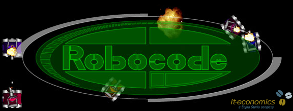
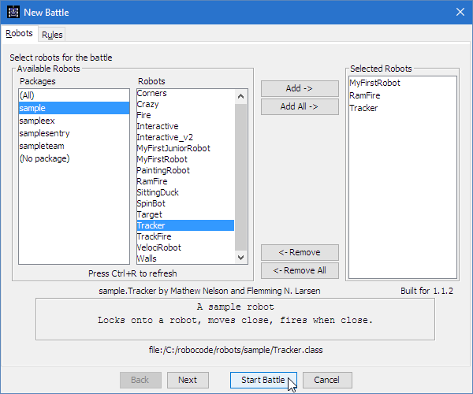
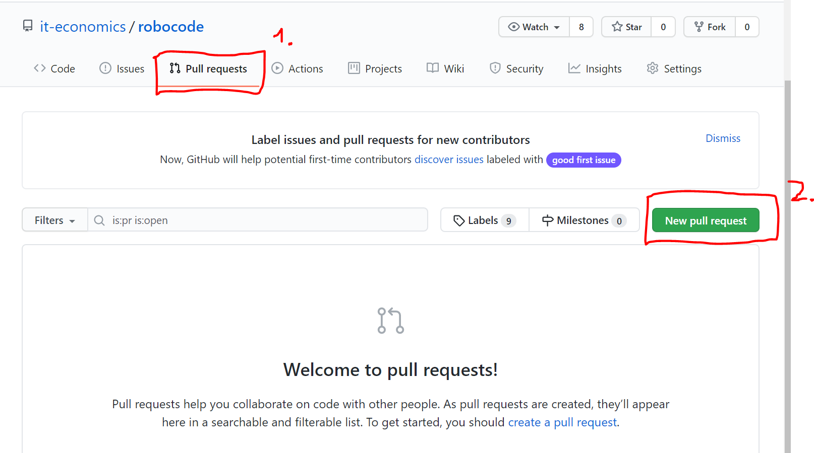

# Robocode@it-economics

## What is Robocode?
Robocode is an Open Source Educational game started by Mathew Nelson (originally provided by IBM). Currently contributions are being made by various people; officially Flemming N. Larsen is working on Robocode to keep it current and fix the bugs. The game is designed to help people learn to program in Java (programming language) and enjoy the experience. It is very easy to start - a simple robot can be written in just a few minutes - but perfecting a bot can take months or more.

## Robocode How-To
Requirements: In order to run Robocode, Java 6 Standard Edition (SE) or a newer version of Java must be installed on your system. Both the Java Runtime Environment (JRE) and the Java Developer Kit (JDK) can be used. Note that the JRE does not include the standard Java compiler (javac), but the JDK does.
1. fork [Github](https://github.com/it-economics/robocode.git) project
2. clone the forked repo into your favourite IDE (currently Eclipse and IntelliJ are automatically supported)
3. Checkout the package structure
4. in `com.ite.robocode` you will find a Java class `MySampleBot`
5. copy this class name to whatever you like (e.g. `MySuperRobot`). This name will be your robots name. Choose wisely! 
6. basic robots extend the `Robot` class. All methods can be manually overwritten. To find some inspiration you can checkout the `Sample` package. 
7. let the fun begin and program your own robot behaviour. 
8. you can test your robots behaviour by performing `gradle run`. In the pop up window press `STRG + N`, choose the package `com.ite.robocode` and add your robot. Add a sample robot from the sample package, hit `Start Battle` and watch your robot perform

9. once you finished or time runs out you need to create a `Pull Request` 

11. you're done. Relax or cheer for your robot while watching the performance against the others!